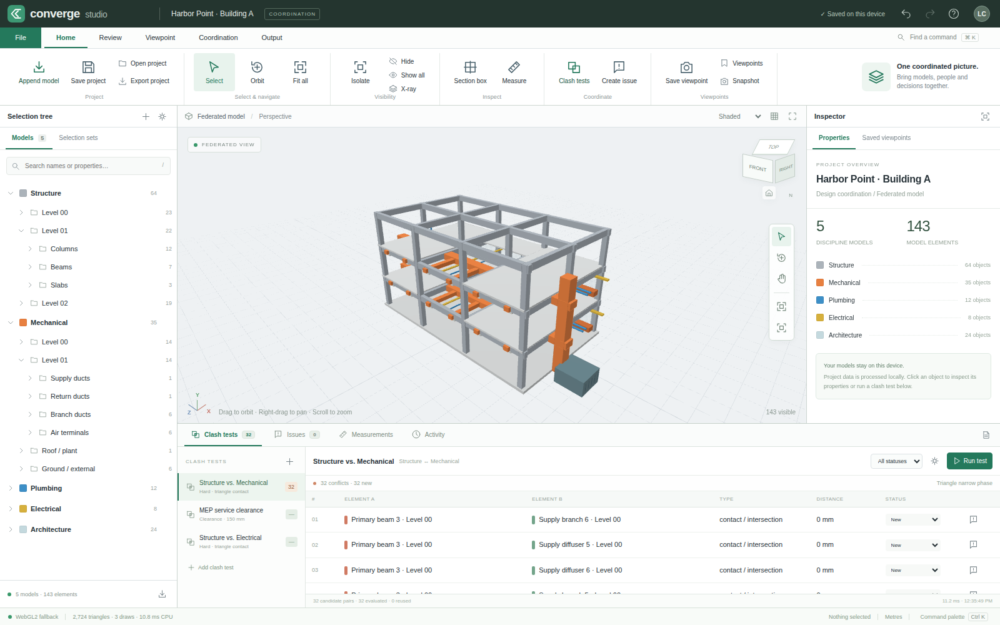

# Converge Studio

[Open live application](https://wieslawsoltes.github.io/ConvergeStudio/) · [Publishing workflow](https://github.com/wieslawsoltes/ConvergeStudio/actions/workflows/pages.yml) · [Deployment guide](docs/DEPLOYMENT.md)

**A working, local-first BIM federation and coordination workbench built with plain HTML, CSS and JavaScript.**

The interface follows familiar desktop coordination workflows: a command ribbon, selection tree, 3D viewport, property/viewpoint inspector, and a docked clash/issue workspace. The implementation, styling, icons and built-in model are original. Converge Studio is not an Autodesk product and does not read proprietary Navisworks files.



## Run immediately

Requires Node.js 20 or newer; development tests were run on Node.js 22.16.0.

```sh
cd converge-studio
npm start
```

Open `http://localhost:8080`. There is no frontend build step and no framework dependency. The included project, glTF/GLB importer, native IFC subset, coordination engine and reports work without installing packages.

For the broader IFC geometry adapter, install the pinned WebAssembly engine:

```sh
npm install
npm start
```

The install script copies `web-ifc@0.0.77` into `vendor/`. No model is uploaded; parsing runs in a dedicated browser worker. The external package and its WASM binary are **not included** in this source archive. Internet access is needed once to install them. After vendoring, the application can be served offline.

An existing service may already occupy port 8080. On macOS/Linux:

```sh
PORT=8090 npm start
```

On PowerShell:

```powershell
$env:PORT = 8090
npm start
```

WebGPU is attempted first. WebGL2 is the second backend, followed by a real z-buffered software rasterizer when browser GPU access is unavailable. The status bar identifies the backend actually in use; the software path is not advertised as GPU acceleration. Serve on localhost or HTTPS for the WebGPU path.

### Self-contained build

`dist/converge-studio.html` contains the application, styles, geometry engine and embedded worker code. Open it in a modern browser, or serve it as a static file. It deliberately uses the **native IFC subset**, not the optional web-ifc adapter. It makes no network requests for dependencies.

Some local-file or embedded browser contexts restrict worker execution or storage. When storage is unavailable, use **Export project** to keep your work, or use the localhost server. Exported `.converge` files include model geometry, not merely references to your source files.

Rebuild the standalone artifact with:

```sh
npm run build
```

## Working functionality

| Area | Implemented behavior |
|---|---|
| Model federation | Append several IFC, GLB or glTF models; keep model identity and hierarchy; edit model translation, Y rotation and uniform scale; hide/show/remove models; undo changes. |
| Rendering | Custom WebGPU and WebGL2 indexed instancing; shaded and wireframe modes; material base colors; ordered-dither transparency; selection and clash colors; reference grid; perspective/orthographic camera. |
| Navigation and picking | Orbit, pan, zoom, fit, focus, axis presets, mouse/touch interaction; integer ID picking in WebGPU, RGB ID picking in WebGL2, ID-buffer picking in software. |
| Inspection | Hierarchical model tree; name/type/property search; multi-selection; property sets and identity; world-space bounds; editable coordination metadata; color overrides; selected-element translation. |
| Selection sets | Create, select and delete named sets using stable element IDs; use sets as clash-test scopes. |
| Sections | Six independently editable world-axis clipping planes, fit-to-selection and reset; clipping applies to visible rendering and picking. |
| Measurements | Pick two real triangle surfaces; store world-space endpoints and linked element IDs; show projected annotations and distances; focus/delete measurements. |
| Clashes and clearance | Model/set/all-element scopes; scene BVH broad phase; triangle BVH narrow phase; contact/intersection, closed-component containment and nearest-surface clearance; worker execution; progress and cancellation. |
| Incremental coordination | Reuse unchanged transformed meshes and pair results; invalidate moved/changed geometry; retain review statuses across reruns; mark results stale after geometry or test edits. |
| Saved viewpoints | Store camera, projection, section box, visibility, selection, clash pair and thumbnail; restore views and undo restoration. |
| Issues | Create issues from selected elements or a clash; retain a linked viewpoint; edit status, priority, assignee, due date, description and timestamped comments. |
| Reports | Standalone printable HTML coordination report, CSV clash register and PNG viewport snapshot. Reports contain project/model information, issues, viewpoints, measurements, warnings and method notes. |
| Persistence | Debounced IndexedDB autosave and restore; portable versioned JSON project import/export; validation before project replacement. |
| History | Bounded 60-command undo/redo history; geometry buffers are outside document snapshots; model import and result invalidation are one transaction. |

### Included sample

Harbor Point · Building A is an original, generated three-level building with **143 entities across five discipline models**. Two shared source meshes are instanced to form structure, ducts, piping, cable trays, plant and glazing. The reference grid is a separate draw batch.

The first test automatically evaluates Structure vs. Mechanical. It finds **32 actual triangle-contact/intersection results**. Those results are computed when the application starts; they are not a prefilled fixture. Run the test again to see unchanged candidate pairs reused.

`examples/` also contains an original IFC4 sample and matching glTF/GLB import fixtures. The IFC fixture exercises an extruded beam, intersecting pipe, tessellated tetrahedron, mapped beam instance, hierarchy and `Pset_BeamCommon.FireRating`.

## A coordination walkthrough

1. Open the sample, then choose **Append model** to add local IFC or GLB files. For external-buffer glTF files, select the `.gltf` file and all referenced `.bin` files together, or drop them together.
2. Select an object in the viewport or tree. Inspect its identity and properties. Ctrl/Command-click extends or toggles selection. Save a selection set from **Review**.
3. Use **Section box** to cut the view, or **Measure** to pick two model surfaces. These are inspection operations: hidden/clipped objects are still included in a clash test's explicit scope.
4. Open **Coordination → New test**, choose the two model/set scopes, and select Hard or Clearance. Clearance values are entered in millimetres; world geometry uses metres.
5. Run the test, select a result, and double-click to focus it. The two elements are colored red and green. Set a review status or create an issue using the issue button in that row.
6. Save a viewpoint and export an HTML report or CSV register. Use **Export project** for a portable backup; **Save project** saves only in the current browser's IndexedDB.

The saved issue is a local project record, not an email assignment or a cloud notification. Source IFC/glTF files are never rewritten by coordination edits.

## Controls

| Input | Action |
|---|---|
| Drag | Orbit |
| Right-drag, middle-drag or Shift-drag | Pan |
| Wheel / pinch | Zoom |
| Click / Ctrl or Command-click | Select / extend selection |
| Double-click | Focus an object or clash |
| V / O / P | Select / Orbit / Pan tool |
| F | Fit visible geometry |
| H / Shift-H / I | Hide / Show all / Isolate |
| B | Toggle section box |
| M | Start two-point measurement |
| Escape | Cancel measurement or clear selection |
| Ctrl/Command-Z; Ctrl/Command-Shift-Z | Undo; redo |
| Ctrl/Command-S | Save locally |
| Ctrl/Command-K | Command palette |
| / | Search model tree |

Dock splitters resize the selection tree, inspector and results area. On narrow layouts, the relevant ribbon command opens the hidden inspector or selection-set dock.

## IFC and glTF support boundaries

### IFC

The optional full adapter uses web-ifc's WebAssembly geometry engine and `StreamAllMeshes`. It copies geometry out of WASM memory, shares repeated geometry IDs, retains per-instance placements and colors, and closes the WASM model after import. It requests `COORDINATE_TO_ORIGIN: false`; models are not independently recentered, which would destroy relative federation positions.

Without the package, the native reader implements STEP records and nested references, IFC strings/Unicode escapes, SI metre prefixes, local-placement chains, spatial relationships and single-value property sets. Its geometry support is intentionally explicit:

- Rectangular, circular and simple arbitrary closed profiles extruded along an axis.
- Simple faceted BReps, triangulated face sets and non-holed polygonal face sets.
- Mapped representations that reuse source geometry.

The native path converts IFC Z-up coordinates to application Y-up coordinates and uses metres. It does not evaluate CSG/boolean clipping, opening subtraction, curved sweeps, NURBS, conversion-based units or IFC map-conversion georeferencing. Unsupported shape representations are skipped with import warnings; openings trigger a warning rather than silently claiming subtraction. Some limitations are file-level errors, including unsupported conversion-based units.

Use the modular server build with web-ifc installed for broader IFC geometry coverage. The web-ifc adapter was implemented against the upstream API but could **not** be executed in the delivery environment because the dependency could not be downloaded. It needs validation on your target models and browsers.

### glTF 2.0 / GLB

The importer supports local external buffers and data URIs, GLB JSON/BIN chunks, indexed or non-indexed triangle lists/strips/fans, hierarchy, node matrix/TRS transforms, normalized/interleaved/sparse vertex accessors, base-color material factors, repeated mesh nodes, `EXT_mesh_gpu_instancing`, and node metadata. The implemented accessors are intended for these static vertex and instance attributes, not every accessor layout in the specification.

Texture images, lighting extensions, animated transforms, morph evaluation, skin deformation, Draco and Meshopt compression are not implemented. Textured materials use their base-color factor with a warning. Unsupported required extensions or compressed primitives fail clearly. Skin/morph content is treated as undeformed mesh geometry with warnings. Remote model-buffer URLs are not fetched.

### Coordination semantics

A hard result means triangle contact/intersection within a **1 micrometre numerical epsilon**, or containment in a closed mesh component. It is **not** a penetration-depth or intersection-volume calculation. Open or non-manifold geometry has no reliable solid-interior classification. The containment test uses welded edge counts and ray parity; it is not an exact-predicate CAD Boolean kernel.

Clearance results use the nearest surface distance found by triangle tests inside the requested threshold. AABB overlap is only a candidate filter, never the final criterion. Clearances are not signed distances and do not report how far one solid penetrates another.

Clash scopes do not change when an element is hidden or clipped. Existing results are marked stale after a transform/import/removal/test edit; rerun before treating them as current. Review statuses remain attached to stable entity-pair IDs. A changed test can therefore retain a previous status for a surviving pair and should still be reviewed.

## Architecture

The source is native JavaScript modules, not a framework app or a wrapped third-party viewer.

```text
index.html / styles.css       Original docked interface and responsive styling
src/app.js                    Commands, pointer interaction, dialogs and workflows
src/core.js                   Document store, validation, history, persistence
src/math.js                   Matrices, AABBs, BVH, camera and ray geometry
src/geometry.js               Mesh validation, normals, primitives, extrusion
src/renderer.js               WebGPU/WGSL and WebGL2/GLSL backends
src/software.js               Real CPU z-buffer and object-ID fallback
src/clash.js                  Triangle distance, containment, incremental engine
src/clash-worker.js           Coordination job protocol and cancellation
src/gltf.js                   Local glTF/GLB parser and mesh instancing
src/ifc.js                    Native STEP/IFC subset and optional WASM adapter
src/import-worker.js          Isolated import execution and transferable buffers
src/reports.js                Escaped HTML, safe CSV, file downloads
src/demo.js / icons.js        Original sample geometry and inline SVG icons
scripts/server.mjs            Dependency-free localhost server
scripts/build-standalone.mjs  Dependency-free single-file packager
scripts/vendor-ifc.mjs        Optional pinned IFC-engine vendoring
scripts/browser-smoke.py      Reproducible browser workflow test
```

See [Architecture](docs/ARCHITECTURE.md) for buffer layout, cache invalidation, worker protocols and precision tradeoffs.

## Validation and reproducibility

```sh
npm test                     # Node's built-in test runner; no npm install needed
npm run build                # Build self-contained HTML
npm run examples             # Regenerate glTF/GLB fixtures
```

The delivered revision passed **65 Node tests and 43 browser workflow checks**, with no uncaught browser JavaScript errors. Tests cover real geometry calculations, import parsing, transactional history, project validation, scene picking, section edits, measurements, viewpoints, issues, worker imports, incremental reruns and exported data.

Browser checks used Chromium 144 and the **software renderer**. The environment did not expose WebGPU or WebGL2 and did not provide a persistent origin for IndexedDB. Consequently, GPU shader/picking execution, real IndexedDB persistence/reload and the full web-ifc adapter remain **unverified**, not assumed to have passed. Portable file round-tripping was tested.

For optional browser checks, install Python Playwright and a Chromium browser in your own environment, then run:

```sh
python scripts/browser-smoke.py --browser /path/to/chromium
# Against the modular application at a real origin:
python scripts/browser-smoke.py --browser /path/to/chromium --url http://localhost:8080
```

The script edits the sample project. Use a fresh browser profile. It reports the backend actually selected and whether storage is available. Export tests capture generated Blob data; they do not validate the operating system's download/save dialog. Test records, screenshot and a generated report are included under `docs/`.

## Scope and operational notes

This is complete runnable source for the implemented workflows, not a claim of one-to-one Navisworks or enterprise-production equivalence. It does not include NWD/NWC/NWF/DWG/RVT readers, Autodesk services, BCF exchange, multi-user synchronization, model-version diffing, clash penetration volumes, section capping, arbitrary angled section planes, walk/gravity navigation, TimeLiner, quantification, texture rendering or animation playback.

There is no out-of-core streaming, LOD system, occlusion culling or GPU clash computation. Coordination runs on the CPU in a worker. Rendering groups repeated geometry into instanced draws but submits the visible instance set; it does not yet implement a frustum-culling pipeline. CPU world transforms/distance calculations use JavaScript doubles, while mesh vertices and GPU matrices use Float32. Large georeferenced coordinates need a floating-origin strategy that is not present in this revision.

Imports have a 512 MB per-file guard. Portable projects have a 2-million-element validation guard; this is a safety ceiling, **not a tested capacity claim**. Candidate generation has a 2-million-pair guard. Actual capacity depends on browser memory, geometry topology, overlap density and GPU binding limits. Large report screenshots and extensive history can also consume memory. Geometry is retained for undo until a project is replaced; export includes only currently referenced geometry.

Browser storage is not a backup. Origin changes, storage eviction and private browsing can discard it. Export `.converge` files for durable copies. Validate imported geometry, units, placement and coordination results against representative source models before using the output for construction decisions.

## Licensing

Original application source and examples: MIT; see [LICENSE](LICENSE). The optional web-ifc dependency is separately licensed under MPL-2.0; see [THIRD_PARTY.md](THIRD_PARTY.md). No proprietary Autodesk code, logos, source files or fonts are included.
